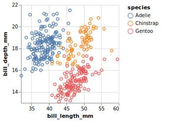

<!-- README.md is generated from README.Rmd. Please edit that file -->

# vegadown

<!-- badges: start -->

[](https://CRAN.R-project.org/package=vegadown)
[](https://www.tidyverse.org/lifecycle/#experimental)
[](https://github.com/vegawidget/vegadown/actions)
<!-- badges: end -->

The goal of vegadown is to help you compose Vega and Vega-Lite specs
within RMarkdown documents.

The audience for this package are people who are already comfortable
with Vega-Lite JSON specs. Compared with using the
[vegawiget](https://vegawidget.github.io/vegawidget) package alone,
vegadown offers a quicker, more minimal, environment for developing
specs. However, it still does not provide humane feedback when something
goes wrong.

## Installation

This package is not (yet) on CRAN. You can install the development
version from GitHub with:

``` r
# install.packages("devtools")
devtools::install_github("vegawidget/vegadown")
```

## Example

``` r
library("vegadown")
library("palmerpenguins")
```

Using vegawidget alone, it can be a bit awkward to compose specs using
lists.

Using this package, you can compose using JSON or YAML within RMarkdown
chunks by specifying the chunk’s language as `vegajson` or `vegayaml`
(`vegayml`). You can interpolate objects from your R environment by
using the delimiters `${}`, much like you would using the
[glue](https://glue.tidyverse.org/) package.

Here’s what your code chunk would look like:

    ```{vegajson json-cars}
    {
      "$schema": "${vega_schema()}",
      "data": {"values": "${penguins}"},
      "mark": "point",
      "encoding": {
        "x": {
          "field": "bill_length_mm",
          "type": "quantitative",
          "scale": {"zero": false}
        },
        "y": {
          "field": "bill_depth_mm",
          "type": "quantitative",
          "scale": {"zero": false}
        },
        "color": {"field": "species", "type": "nominal"}
      }
    }
    ```

Here’s how it would appear:

<!-- -->

You can access your vegaspecs elsewhere in your RMarkdown document,
using the `vegadown()` function with the chunk label:

``` r
str(vegadown("json-penguins"))
#> List of 4
#>  $ $schema : chr "https://vega.github.io/schema/vega-lite/v4.json"
#>  $ data    :List of 1
#>   ..$ values: tibble [344 × 8] (S3: tbl_df/tbl/data.frame)
#>   .. ..$ species          : Factor w/ 3 levels "Adelie","Chinstrap",..: 1 1 1 1 1 1 1 1 1 1 ...
#>   .. ..$ island           : Factor w/ 3 levels "Biscoe","Dream",..: 3 3 3 3 3 3 3 3 3 3 ...
#>   .. ..$ bill_length_mm   : num [1:344] 39.1 39.5 40.3 NA 36.7 39.3 38.9 39.2 34.1 42 ...
#>   .. ..$ bill_depth_mm    : num [1:344] 18.7 17.4 18 NA 19.3 20.6 17.8 19.6 18.1 20.2 ...
#>   .. ..$ flipper_length_mm: int [1:344] 181 186 195 NA 193 190 181 195 193 190 ...
#>   .. ..$ body_mass_g      : int [1:344] 3750 3800 3250 NA 3450 3650 3625 4675 3475 4250 ...
#>   .. ..$ sex              : Factor w/ 2 levels "female","male": 2 1 1 NA 1 2 1 2 NA NA ...
#>   .. ..$ year             : int [1:344] 2007 2007 2007 2007 2007 2007 2007 2007 2007 2007 ...
#>  $ mark    : chr "point"
#>  $ encoding:List of 3
#>   ..$ x    :List of 3
#>   .. ..$ field: chr "bill_length_mm"
#>   .. ..$ type : chr "quantitative"
#>   .. ..$ scale:List of 1
#>   .. .. ..$ zero: logi FALSE
#>   ..$ y    :List of 3
#>   .. ..$ field: chr "bill_depth_mm"
#>   .. ..$ type : chr "quantitative"
#>   .. ..$ scale:List of 1
#>   .. .. ..$ zero: logi FALSE
#>   ..$ color:List of 2
#>   .. ..$ field: chr "species"
#>   .. ..$ type : chr "nominal"
#>  - attr(*, "class")= chr [1:4] "vegaspec_unit" "vegaspec_vega_lite" "vegaspec" "list"
```

For more detail, please see the [getting started
article](https://vegawidget.github.io/vegadown/articles/vegadown.html),
which also shows:

-   how to compose a vegaspec using YAML.
-   more details on interpolating objects from your R environment into
    `vegajson` or `vegayaml` (`vegayml`).

## Code of Conduct

Please note that the vegadown project is released with a [Contributor
Code of
Conduct](https://contributor-covenant.org/version/2/0/CODE_OF_CONDUCT.html).
By contributing to this project, you agree to abide by its terms.
