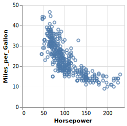

<!-- README.md is generated from README.Rmd. Please edit that file -->

# vegadown

The goal of vegadown is to help you compose Vega and Vega-Lite specs in
RMardown documents.

## Installation

This package is not (yet) on CRAN. You can install the dev version of
vegadown from GitHub with:

``` r
# install.packages("devtools")
devtools::install_github("vegawidget/vegadown")
```

## Example

``` r
library("vegadown")

# makes it easier to set data URL in specs
vw_set_base_url("https://cdn.jsdelivr.net/npm/vega-datasets@2")
```

When coding, it can be a bit awkward to compose vegaspecs using lists.
Using this packaage, you can compose using JSON or YAML in RMarkdown by
specifying a chunk’s language as `vegajson`, `vegayaml` or `vegayml`.

Here’s what your code chunk would look like:

    ```{vegajson json-cars}
    {
      "$schema": "https://vega.github.io/schema/vega-lite/v4.json",
      "description": "A scatterplot showing horsepower and miles per gallons for various cars.",
      "data": {"url": "data/cars.json"},
      "mark": "point",
      "encoding": {
        "x": {"field": "Horsepower", "type": "quantitative"},
        "y": {"field": "Miles_per_Gallon", "type": "quantitative"}
      }
    }
    ```

Here’s how it would appear:

``` json
{
  "$schema": "https://vega.github.io/schema/vega-lite/v4.json",
  "description": "A scatterplot showing horsepower and miles per gallons for various cars.",
  "data": {"url": "data/cars.json"},
  "mark": "point",
  "encoding": {
    "x": {"field": "Horsepower", "type": "quantitative"},
    "y": {"field": "Miles_per_Gallon", "type": "quantitative"}
  }
}
```

<!-- -->

For more detail, please see the [getting started
article](https://vegawidget.github.io/vegadown/articles/vegadown.html).

## Code of Conduct

Please note that the vegadown project is released with a [Contributor
Code of
Conduct](https://contributor-covenant.org/version/2/0/CODE_OF_CONDUCT.html).
By contributing to this project, you agree to abide by its terms.
